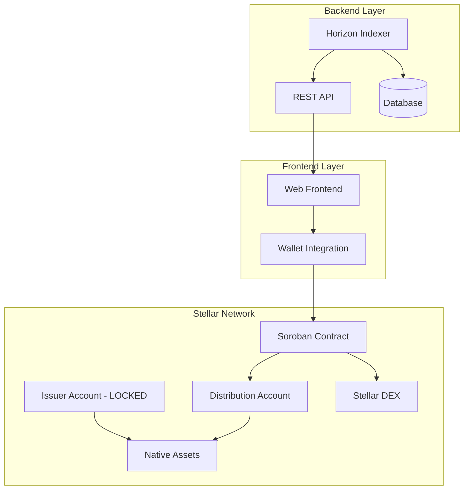
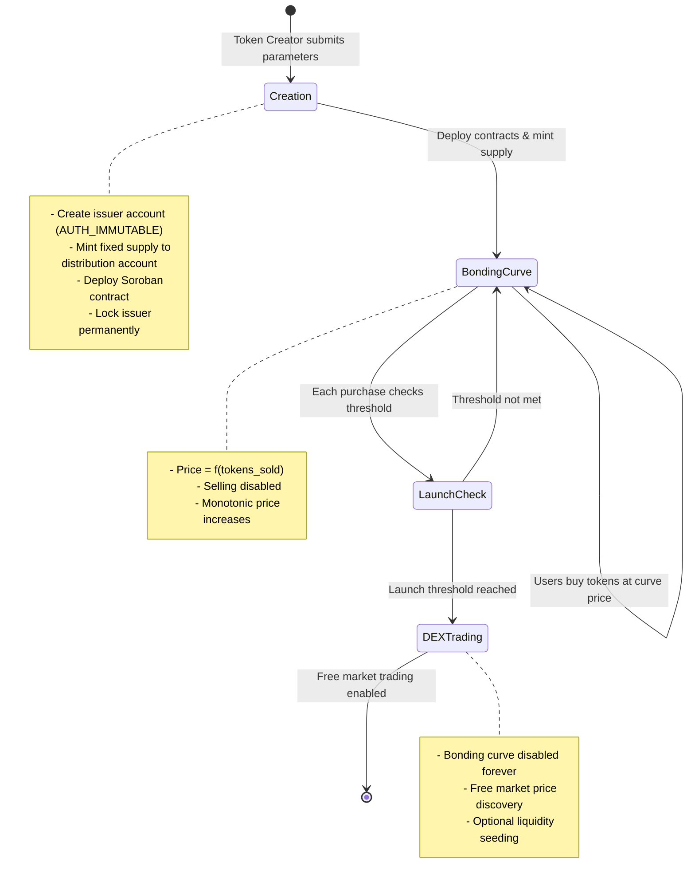

# Design Document

## Overview

The Stellar Pump.fun launchpad is a trust-minimized token launch platform built on Stellar's native asset system and Soroban smart contracts. The architecture ensures mathematical impossibility of rug-pulls through immutable issuer accounts, deterministic bonding curves, and irreversible launch transitions to the Stellar DEX.

The system consists of four main components:
1. **Soroban Smart Contract**: Core logic for token distribution, pricing, and launch mechanics
2. **Native Asset Management**: Stellar-native tokens with locked issuers and controlled distribution
3. **Frontend Application**: Clean UX hiding blockchain complexity with wallet integration
4. **Backend Indexer**: Real-time data aggregation and analytics via Horizon API

## Architecture

### System Architecture Diagram



### Token Lifecycle Flow



## Components and Interfaces

### 1. Soroban Smart Contract

#### Core Contract Structure

```rust
// Primary contract state
pub struct LaunchpadState {
    pub token_address: Address,           // Native asset identifier
    pub distribution_account: Address,    // Account holding token supply
    pub total_supply: i128,              // Fixed token supply
    pub tokens_sold: i128,               // Tokens sold via bonding curve
    pub xlm_raised: i128,                // Total XLM collected
    pub launch_threshold_xlm: i128,      // XLM target for launch
    pub launch_threshold_percent: u32,   // % of supply target for launch
    pub is_launched: bool,               // Irreversible launch flag
    pub curve_params: CurveParameters,   // Bonding curve configuration
    pub creator: Address,                // Token creator (no special privileges)
    pub creation_time: u64,              // Launch timestamp
}

pub struct CurveParameters {
    pub curve_type: CurveType,           // Linear, Quadratic, etc.
    pub base_price: i128,                // Starting price in stroops
    pub price_multiplier: i128,          // Price scaling factor
}
```

#### Key Contract Functions

```rust
// Token creation (called once per token)
pub fn create_token(
    env: Env,
    creator: Address,
    token_code: String,
    token_name: String,
    total_supply: i128,
    launch_threshold_xlm: i128,
    curve_params: CurveParameters
) -> Result<Address, ContractError>;

// Primary purchase function
pub fn buy_tokens(
    env: Env,
    buyer: Address,
    xlm_amount: i128
) -> Result<i128, ContractError>; // Returns tokens received

// Price calculation (view function)
pub fn get_current_price(env: Env) -> Result<i128, ContractError>;

// Launch status check
pub fn check_and_execute_launch(env: Env) -> Result<bool, ContractError>;

// Token information queries
pub fn get_token_info(env: Env) -> Result<TokenInfo, ContractError>;
```

#### Bonding Curve Implementation

**Linear Curve Formula:**
```
price = base_price + (tokens_sold * price_multiplier / total_supply)
tokens_out = xlm_in / current_price
```

**Quadratic Curve Formula:**
```
price = base_price + (tokens_sold^2 * price_multiplier / total_supply^2)
```

**Implementation Logic:**
```rust
impl BondingCurve {
    pub fn calculate_tokens_for_xlm(&self, xlm_amount: i128, tokens_sold: i128) -> i128 {
        match self.curve_type {
            CurveType::Linear => {
                let current_price = self.base_price + 
                    (tokens_sold * self.price_multiplier / self.total_supply);
                xlm_amount / current_price
            },
            CurveType::Quadratic => {
                // Quadratic integration for exact calculation
                self.quadratic_integration(xlm_amount, tokens_sold)
            }
        }
    }
    
    fn quadratic_integration(&self, xlm_amount: i128, start_supply: i128) -> i128 {
        // Solve integral: ∫(base_price + k*x^2)dx from start_supply to end_supply = xlm_amount
        // Returns end_supply - start_supply (tokens purchased)
    }
}
```

### 2. Native Asset Management

#### Asset Creation Process

```rust
// Issuer account creation with AUTH_IMMUTABLE
pub fn create_immutable_issuer(env: Env, asset_code: String) -> Result<Address, Error> {
    let issuer_keypair = generate_keypair();
    let issuer_account = create_account(issuer_keypair.public_key());
    
    // Set AUTH_IMMUTABLE flag - prevents future minting
    set_account_flags(issuer_account, AccountFlags::AUTH_IMMUTABLE);
    
    // Create the native asset
    let asset = Asset::new(asset_code, issuer_account);
    
    // Mint entire supply to distribution account
    mint_asset(asset, TOTAL_SUPPLY, distribution_account);
    
    // Lock issuer account permanently (remove signing keys)
    remove_all_signers(issuer_account);
    
    Ok(issuer_account)
}
```

#### Distribution Account Control

```rust
// Distribution account controlled by Soroban contract
pub struct DistributionController {
    contract_address: Address,
    distribution_account: Address,
}

impl DistributionController {
    pub fn transfer_tokens(&self, recipient: Address, amount: i128) -> Result<(), Error> {
        // Only callable by Soroban contract
        require_auth(&self.contract_address);
        
        // Execute token transfer from distribution account
        transfer_asset(
            &self.distribution_account,
            &recipient,
            &self.asset,
            amount
        )
    }
}
```

### 3. Launch Mechanics

#### Launch Condition Evaluation

```rust
pub fn evaluate_launch_conditions(&self, state: &LaunchpadState) -> bool {
    if state.is_launched {
        return true; // Already launched
    }
    
    let xlm_threshold_met = state.xlm_raised >= state.launch_threshold_xlm;
    let supply_threshold_met = (state.tokens_sold * 100 / state.total_supply) >= 
        state.launch_threshold_percent as i128;
    
    xlm_threshold_met || supply_threshold_met
}
```

#### DEX Transition Process

```rust
pub fn execute_launch_transition(env: Env) -> Result<(), ContractError> {
    let mut state = get_state(&env)?;
    
    // Verify launch conditions
    require!(evaluate_launch_conditions(&state), "Launch conditions not met");
    require!(!state.is_launched, "Already launched");
    
    // Mark as launched (irreversible)
    state.is_launched = true;
    save_state(&env, &state)?;
    
    // Optional: Seed initial DEX liquidity
    if should_seed_liquidity(&state) {
        seed_dex_liquidity(&env, &state)?;
    }
    
    // Emit launch event
    emit_event(&env, LaunchEvent {
        token_address: state.token_address.clone(),
        final_price: calculate_final_price(&state),
        xlm_raised: state.xlm_raised,
        tokens_sold: state.tokens_sold,
    });
    
    Ok(())
}
```

### 4. Frontend Application

#### Component Architecture

```typescript
// Core application structure
interface AppComponents {
  // Pages
  LandingPage: React.FC;           // Token discovery and trending
  TokenCreationPage: React.FC;     // New token launch interface
  TokenDetailPage: React.FC<{id: string}>; // Individual token view
  
  // Shared Components
  WalletConnector: React.FC;       // Freighter/Albedo integration
  BondingCurveChart: React.FC<{tokenId: string}>; // Price visualization
  TokenPurchaseWidget: React.FC<{tokenId: string}>; // Buy interface
  TokenMetrics: React.FC<{tokenId: string}>; // Stats display
  
  // Utilities
  StellarService: StellarServiceInterface; // Blockchain interactions
  TrustlineManager: TrustlineManagerInterface; // Automatic trustline handling
}
```

#### Wallet Integration

```typescript
interface WalletService {
  // Wallet connection management
  connect(): Promise<WalletConnection>;
  disconnect(): void;
  getPublicKey(): string | null;
  
  // Transaction signing
  signTransaction(xdr: string): Promise<string>;
  
  // Trustline management
  createTrustline(assetCode: string, issuer: string): Promise<TransactionResult>;
  checkTrustline(assetCode: string, issuer: string): Promise<boolean>;
}

class FreighterWalletService implements WalletService {
  async connect(): Promise<WalletConnection> {
    if (!window.freighter) {
      throw new Error("Freighter wallet not installed");
    }
    
    const publicKey = await window.freighter.getPublicKey();
    return { publicKey, walletType: 'freighter' };
  }
  
  async signTransaction(xdr: string): Promise<string> {
    return await window.freighter.signTransaction(xdr, "PUBLIC");
  }
}
```

#### Purchase Flow Implementation

```typescript
class TokenPurchaseService {
  async purchaseTokens(tokenId: string, xlmAmount: number): Promise<PurchaseResult> {
    const wallet = await this.walletService.connect();
    
    // 1. Check and create trustline if needed
    const needsTrustline = !(await this.checkTrustline(tokenId, wallet.publicKey));
    if (needsTrustline) {
      await this.createTrustline(tokenId, wallet.publicKey);
    }
    
    // 2. Build purchase transaction
    const transaction = await this.buildPurchaseTransaction(
      tokenId, 
      xlmAmount, 
      wallet.publicKey
    );
    
    // 3. Sign and submit
    const signedXdr = await wallet.signTransaction(transaction.toXDR());
    const result = await this.stellarService.submitTransaction(signedXdr);
    
    // 4. Return purchase details
    return {
      transactionHash: result.hash,
      tokensReceived: this.calculateTokensReceived(xlmAmount, tokenId),
      newPrice: await this.getUpdatedPrice(tokenId)
    };
  }
}
```

### 5. Backend Indexer

#### Event Indexing Architecture

```typescript
interface IndexerService {
  // Core indexing functions
  indexTokenCreation(transaction: StellarTransaction): Promise<void>;
  indexTokenPurchase(transaction: StellarTransaction): Promise<void>;
  indexTokenLaunch(transaction: StellarTransaction): Promise<void>;
  
  // Data aggregation
  calculateTokenMetrics(tokenId: string): Promise<TokenMetrics>;
  updateTokenRankings(): Promise<void>;
  
  // API endpoints
  getTokenList(filter: TokenFilter): Promise<TokenSummary[]>;
  getTokenDetails(tokenId: string): Promise<TokenDetails>;
  getTokenHistory(tokenId: string): Promise<PriceHistory[]>;
}
```

#### Real-time Data Pipeline

```typescript
class HorizonIndexer {
  private horizonServer: Server;
  private database: Database;
  
  async startIndexing(): Promise<void> {
    // Stream all transactions affecting our contracts
    this.horizonServer
      .transactions()
      .cursor('now')
      .stream({
        onmessage: (transaction) => this.processTransaction(transaction),
        onerror: (error) => this.handleError(error)
      });
  }
  
  private async processTransaction(tx: TransactionRecord): Promise<void> {
    // Parse contract invocations
    const contractCalls = this.parseContractCalls(tx);
    
    for (const call of contractCalls) {
      switch (call.function) {
        case 'create_token':
          await this.indexTokenCreation(call, tx);
          break;
        case 'buy_tokens':
          await this.indexTokenPurchase(call, tx);
          break;
        case 'execute_launch_transition':
          await this.indexTokenLaunch(call, tx);
          break;
      }
    }
    
    // Update derived metrics
    await this.updateAggregatedMetrics();
  }
}
```

## Data Models

### Database Schema

```sql
-- Core token information
CREATE TABLE tokens (
    id UUID PRIMARY KEY,
    asset_code VARCHAR(12) NOT NULL,
    issuer_address VARCHAR(56) NOT NULL,
    distribution_address VARCHAR(56) NOT NULL,
    contract_address VARCHAR(56) NOT NULL,
    creator_address VARCHAR(56) NOT NULL,
    
    -- Token metadata
    name VARCHAR(255) NOT NULL,
    symbol VARCHAR(12) NOT NULL,
    image_url TEXT,
    description TEXT,
    
    -- Supply and economics
    total_supply BIGINT NOT NULL,
    tokens_sold BIGINT DEFAULT 0,
    xlm_raised BIGINT DEFAULT 0,
    current_price BIGINT NOT NULL,
    
    -- Launch configuration
    launch_threshold_xlm BIGINT NOT NULL,
    launch_threshold_percent INTEGER NOT NULL,
    is_launched BOOLEAN DEFAULT FALSE,
    launched_at TIMESTAMP,
    
    -- Curve parameters
    curve_type VARCHAR(20) NOT NULL,
    base_price BIGINT NOT NULL,
    price_multiplier BIGINT NOT NULL,
    
    -- Metadata
    created_at TIMESTAMP DEFAULT NOW(),
    updated_at TIMESTAMP DEFAULT NOW(),
    
    UNIQUE(asset_code, issuer_address)
);

-- Purchase history
CREATE TABLE purchases (
    id UUID PRIMARY KEY,
    token_id UUID REFERENCES tokens(id),
    buyer_address VARCHAR(56) NOT NULL,
    xlm_amount BIGINT NOT NULL,
    tokens_received BIGINT NOT NULL,
    price_per_token BIGINT NOT NULL,
    transaction_hash VARCHAR(64) NOT NULL UNIQUE,
    created_at TIMESTAMP DEFAULT NOW()
);

-- Token holders
CREATE TABLE holders (
    token_id UUID REFERENCES tokens(id),
    holder_address VARCHAR(56) NOT NULL,
    balance BIGINT NOT NULL,
    first_purchase_at TIMESTAMP NOT NULL,
    last_purchase_at TIMESTAMP NOT NULL,
    total_purchased BIGINT NOT NULL,
    
    PRIMARY KEY (token_id, holder_address)
);

-- Aggregated metrics
CREATE TABLE token_metrics (
    token_id UUID PRIMARY KEY REFERENCES tokens(id),
    holder_count INTEGER DEFAULT 0,
    volume_24h BIGINT DEFAULT 0,
    volume_7d BIGINT DEFAULT 0,
    volume_total BIGINT DEFAULT 0,
    purchases_24h INTEGER DEFAULT 0,
    price_change_24h DECIMAL(10,4) DEFAULT 0,
    market_cap BIGINT DEFAULT 0,
    updated_at TIMESTAMP DEFAULT NOW()
);
```

### API Response Models

```typescript
interface TokenSummary {
  id: string;
  name: string;
  symbol: string;
  imageUrl?: string;
  currentPrice: string;        // In stroops
  marketCap: string;          // In stroops
  volume24h: string;          // In stroops
  priceChange24h: number;     // Percentage
  holderCount: number;
  launchProgress: number;     // Percentage to launch
  isLaunched: boolean;
  createdAt: string;
}

interface TokenDetails extends TokenSummary {
  description?: string;
  totalSupply: string;
  tokensSold: string;
  xlmRaised: string;
  launchThresholdXlm: string;
  launchThresholdPercent: number;
  contractAddress: string;
  issuerAddress: string;
  creatorAddress: string;
  bondingCurve: {
    type: 'linear' | 'quadratic';
    basePrice: string;
    priceMultiplier: string;
  };
}
```

## Error Handling

### Contract Error Types

```rust
#[derive(Debug, PartialEq)]
pub enum ContractError {
    // Authorization errors
    Unauthorized,
    InvalidSigner,
    
    // State errors
    AlreadyLaunched,
    NotLaunched,
    InvalidTokenState,
    
    // Parameter validation
    InvalidAmount,
    InsufficientFunds,
    InvalidCurveParameters,
    InvalidLaunchThreshold,
    
    // Asset errors
    AssetNotFound,
    TrustlineRequired,
    IssuerLocked,
    
    // System errors
    CalculationOverflow,
    StorageError,
    NetworkError,
}
```

### Frontend Error Handling

```typescript
class ErrorHandler {
  static handleContractError(error: ContractError): UserFriendlyError {
    switch (error.type) {
      case 'TrustlineRequired':
        return {
          title: 'Trustline Required',
          message: 'We need to set up your wallet to hold this token. This will be done automatically.',
          action: 'retry_with_trustline'
        };
      
      case 'InsufficientFunds':
        return {
          title: 'Insufficient XLM',
          message: 'You need more XLM to complete this purchase.',
          action: 'check_balance'
        };
      
      case 'AlreadyLaunched':
        return {
          title: 'Token Already Launched',
          message: 'This token has moved to DEX trading. You can trade it on the Stellar DEX.',
          action: 'redirect_to_dex'
        };
      
      default:
        return {
          title: 'Transaction Failed',
          message: 'Something went wrong. Please try again.',
          action: 'retry'
        };
    }
  }
}
```

## Testing Strategy

### Contract Testing

```rust
#[cfg(test)]
mod tests {
    use super::*;
    
    #[test]
    fn test_bonding_curve_monotonic() {
        let curve = LinearBondingCurve::new(1000, 100); // base_price, multiplier
        
        let price1 = curve.get_price(0);      // At 0 tokens sold
        let price2 = curve.get_price(1000);   // At 1000 tokens sold
        let price3 = curve.get_price(2000);   // At 2000 tokens sold
        
        assert!(price1 < price2);
        assert!(price2 < price3);
    }
    
    #[test]
    fn test_launch_transition_irreversible() {
        let mut contract = setup_test_contract();
        
        // Trigger launch
        contract.execute_launch_transition().unwrap();
        assert!(contract.is_launched());
        
        // Attempt to buy after launch should fail
        let result = contract.buy_tokens(test_buyer(), 1000);
        assert_eq!(result.unwrap_err(), ContractError::AlreadyLaunched);
    }
    
    #[test]
    fn test_rug_pull_prevention() {
        let contract = setup_test_contract();
        
        // Verify issuer cannot mint more tokens
        let issuer_result = mint_additional_tokens(contract.issuer_address(), 1000);
        assert!(issuer_result.is_err());
        
        // Verify no admin withdraw function exists
        assert!(!contract.has_function("admin_withdraw"));
        assert!(!contract.has_function("emergency_stop"));
    }
}
```

### Integration Testing

```typescript
describe('Token Launch Flow', () => {
  it('should complete full launch cycle', async () => {
    // 1. Create token
    const token = await createTestToken({
      name: 'Test Token',
      symbol: 'TEST',
      totalSupply: 1000000,
      launchThresholdXlm: 10000
    });
    
    // 2. Purchase tokens until launch
    let totalPurchased = 0;
    while (!token.isLaunched && totalPurchased < 10000) {
      await purchaseTokens(token.id, 1000);
      totalPurchased += 1000;
      await token.refresh();
    }
    
    // 3. Verify launch occurred
    expect(token.isLaunched).toBe(true);
    
    // 4. Verify bonding curve disabled
    await expect(purchaseTokens(token.id, 1000))
      .rejects.toThrow('AlreadyLaunched');
    
    // 5. Verify DEX trading enabled
    const dexOffers = await getStellarDEXOffers(token.assetCode, token.issuer);
    expect(dexOffers.length).toBeGreaterThan(0);
  });
});
```

This design provides a comprehensive architecture for building a production-ready Stellar Pump.fun launchpad with mathematical guarantees against rug-pulls, deterministic pricing, and seamless user experience.